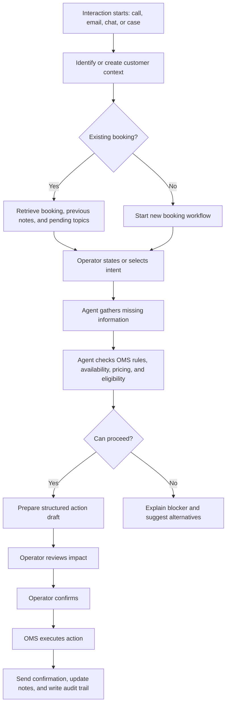

# Call Center OMS Agent Context

## Product Intent

Build a semi-agentic AI experience for Carnival UK call center operators that helps them handle customer interactions faster, safer, and with better operational confidence.

The agent should not behave like a generic chatbot. It should behave like an operational co-pilot that understands customer context, booking context, OMS rules, and the next safest action.

The core product shift is:

> Start from the customer interaction, not from a booking list.

A booking is an object inside the interaction. Sometimes the customer has an existing booking ID. Sometimes they are calling to create a new booking. Sometimes the interaction starts from email, chat, or a back-office case. The interface should support all of these without forcing the user into a booking-first workflow.

## Problems We Are Solving

### 1. Operators Lack A Clear Interaction Context

Current booking-first layouts show booking records, but they do not clearly answer:

- Who is contacting us?
- Through which channel?
- Has the customer been verified?
- What does the customer need?
- Are there previous notes or pending topics?
- Is this an existing booking issue or a new booking request?

Real value:

- Faster call opening.
- Better continuity across calls, emails, chats, and cases.
- Lower risk of missing previous notes or unresolved customer issues.
- Better customer experience because the operator starts informed.

### 2. The Booking List Creates Noise During Active Work

A permanent list of many bookings is useful for search and queue work, but it can distract the operator during a live interaction. Once an operator is modifying, cancelling, or creating a booking, the priority becomes focus and confidence.

Real value:

- Reduces cognitive load.
- Helps operators stay focused on the current customer need.
- Prevents accidental action on the wrong booking.
- Supports both existing-booking and no-booking journeys.

Recommended direction:

- Replace the permanent booking list with an Interaction Panel.
- Keep booking search, booking menus, related bookings, and operational queues as contextual modes.

### 3. Static Booking Details Are Redundant

The current right-side panel shows booking and guest details, but it risks becoming a static duplicate of information shown elsewhere. In an AI-assisted workflow, the right panel can provide more value as a dynamic operational confidence layer.

Real value:

- Turns passive data into decision support.
- Shows eligibility, rules, price impact, availability, refund implications, and audit consequences.
- Helps operators explain outcomes to customers.

Recommended direction:

- Convert the right panel into a Dynamic Context / Impact / Rules panel.

### 4. Chat Alone Is Not Enough For Operational Actions

Chat is good for natural language, intent detection, explanations, and customer-facing summaries. But modification, cancellation, refund, and booking actions need structured flows.

Real value:

- Reduces operator mistakes.
- Makes confirmation steps clear.
- Supports auditability.
- Creates a safer path from request to execution.

Recommended direction:

- Use chat as the conversation and reasoning layer.
- Use structured cards and task workspaces for editable actions, previews, confirmations, and OMS execution results.

### 5. Operators Need To Know Why Something Is Possible Or Blocked

The agent should not only say "cannot proceed." It should explain the operational reason, such as sold-out availability, cancellation policy, missing verification, payment issue, rule conflict, or sailing date restriction.

Real value:

- Improves operator confidence.
- Reduces escalations.
- Gives the operator a customer-facing explanation.
- Helps standardize policy communication.

### 6. Wrong-Booking Actions Are A Major Risk

The screenshots show a potential mismatch between selected booking, modified booking, and cancelled booking. This may be prototype data, but it highlights a critical UX risk.

Real value:

- Prevents costly operational errors.
- Protects customer trust.
- Makes the system safer for high-volume call center use.

Required guardrail:

- One active booking for execution at a time.
- Related bookings may be visible, but execution requires a clear active booking.
- Switching active booking should be explicit and visible.

### 7. Confirmation Workflows Need To Include Follow-Up Actions

OMS execution is not the final step. The system may also need to send confirmation emails, update notes, create an audit trail, flag exceptions, or trigger payment/refund flows.

Real value:

- Reduces manual after-call work.
- Improves record quality.
- Makes service delivery more consistent.
- Supports compliance and later investigation.

### 8. Performance Needs To Be Measured At Agent And Operation Level

The feature should improve both user experience and business outcomes. It should include metrics around operator performance and agent assistance quality.

Real value:

- Gives managers evidence of productivity gains.
- Helps identify training needs.
- Helps improve the AI agent over time.
- Supports scaling the operating model across teams.

Potential metrics:

- Average handling time.
- First contact resolution.
- Number of actions completed through the agent.
- Number of blocked actions explained.
- Escalation rate.
- Confirmation error rate.
- Reopen rate.
- Customer satisfaction after assisted action.
- Operator acceptance rate of AI suggestions.
- Agent confidence and correction rate.

## Recommended Information Architecture

Move from:

```text
Booking List + Chat + Static Booking Details
```

To:

```text
Interaction Panel + Agent Workspace + Dynamic Context Panel
```

### Left Panel: Interaction Panel

Purpose:

- Anchor the operator in the customer interaction.
- Show channel, customer identity, verification, need, previous notes, related bookings, and search.

Should include:

- Interaction source: call, email, chat, case, back-office request.
- Customer name and contact information.
- Verification status.
- Current customer need.
- Previous notes and pending topics.
- Related bookings.
- Booking/customer search.
- Start new booking option.
- Add note and escalate actions.

### Center: Agent Workspace

Purpose:

- Let the operator talk to the agent.
- Show structured operational flows.
- Stage actions before execution.

Should include:

- AI conversation.
- Suggested starting actions.
- Structured action cards.
- Editable forms for modification/new booking.
- Confirmation screens.
- OMS execution results.
- Customer-facing response summary.

### Right Panel: Dynamic Context / Impact / Rules Panel

Purpose:

- Explain whether the current action is safe, allowed, blocked, or needs review.

Should adapt by workflow:

- Lookup: customer profile, verification, related records.
- Modify: current state, requested change, availability, price difference, rule checks.
- Cancel: cancellation scope, refund amount, fees, email confirmation, audit note.
- New booking: availability, basket, payment status, required fields.
- Blocked action: reason, alternatives, escalation route.

## Core Workflow



## Agent Model

The user should experience one unified Order Agent. Internally, the product can reflect specialized capabilities.

### Lookup Capability

- Finds customers and bookings.
- Resolves ambiguity.
- Identifies related bookings.
- Supports no-booking journeys.

### Interaction Context Capability

- Understands channel source.
- Summarizes customer need.
- Surfaces previous notes and pending topics.
- Tracks what has happened in the current session.

### Modification Capability

- Handles guest count, time slot, date, cabin, venue, line item, and other supported changes.
- Checks availability before suggesting a change.
- Shows before/after state.

### Cancellation Capability

- Supports full booking cancellation.
- Supports line-item cancellation, such as spa or experience cancellation.
- Supports guest-level cancellation where applicable.
- Shows refund/fee impact before confirmation.

### New Booking Capability

- Guides the operator through customer details, availability, selection, pricing, and confirmation.
- Supports customers who do not have a booking ID.

### Policy And Rules Capability

- Explains why an action is allowed, blocked, fee-bearing, or requires escalation.
- Uses OMS rules and standard business policies.

### Confirmation And Follow-Up Capability

- Prepares final confirmation.
- Executes only after operator approval.
- Sends confirmation email when required.
- Updates notes and audit trail.
- Produces a customer-facing summary.

## Agent Guidelines

The agent should:

- Always make the active customer and active booking clear.
- Ask for missing information before preparing an action.
- Never execute an OMS action without explicit operator confirmation.
- Explain policy blockers in plain operational language.
- Offer next-best alternatives when the requested action is unavailable.
- Show before/after state for modifications.
- Show financial impact for cancellation, refund, price difference, and service charge changes.
- Create or suggest notes after meaningful actions.
- Provide a customer-facing summary after execution.
- Surface uncertainty instead of pretending confidence.
- Keep the operator in control.

The agent should not:

- Execute actions based only on inferred intent.
- Mix execution context across multiple bookings.
- Hide fees, refund impact, or policy constraints.
- Present unavailable options as selectable.
- Overload the operator with unrelated booking records during active work.

## UX Principles

### 1. Interaction First

The interface should begin with the customer interaction. Booking context should attach to that interaction.

### 2. One Active Execution Context

Only one booking should be active for execution at a time. Related bookings can be visible, but action cards must clearly indicate which booking they affect.

### 3. Chat For Conversation, Structure For Action

Use chat for natural language and reasoning. Use structured cards and panels for operational decisions.

### 4. Dynamic Context Over Static Data

The right panel should adapt to the current task and show what matters now.

### 5. Preview Before Commit

Every meaningful OMS action should have a review step before execution.

### 6. Explain The Why

The system should explain blocked actions, fees, sold-out states, policy conflicts, and required escalations.

### 7. Reduce Cognitive Load

Avoid showing large unrelated lists during active work. Keep the operator focused on the customer, intent, and next step.

### 8. Make Follow-Up Automatic

After execution, the system should help send confirmation, update notes, and create an audit trail.

## Functionality Principles

- Support call, email, chat, case, and back-office interaction sources.
- Support existing booking lookup and new booking creation.
- Support customer search by name, email, phone, and booking ID.
- Support previous notes and pending topics.
- Support modification, cancellation, refund/price impact, and availability checks.
- Support clear confirmation before OMS execution.
- Support automated follow-up actions after execution.
- Support supervisor escalation when policy or system confidence requires it.
- Support agent performance analytics.

## Accessibility Principles

- All actions must be keyboard accessible.
- Interactive controls need visible focus states.
- Status, warning, success, and error states must not rely on color alone.
- Forms must use accessible labels and validation messages.
- Action cards should have clear headings and logical reading order.
- Confirmation dialogs must be announced clearly to assistive technologies.
- Icons should have accessible names or hidden decorative treatment.
- Text should maintain sufficient contrast.
- Dense panels should preserve readable spacing and avoid truncating critical operational data.
- The layout should remain usable at common desktop resolutions and support zoom without breaking task flow.

## Suggested MVP Scope

MVP should support:

- Interaction panel with channel, customer identity, verification, previous notes, and related booking.
- Booking/customer lookup.
- Active booking lock for execution.
- Modify booking workflow.
- Cancel booking workflow, including partial line-item cancellation.
- New booking entry point.
- Dynamic right panel for context, rules, and impact.
- Operator confirmation before execution.
- Post-action confirmation email, note update, and audit event.
- Basic performance metrics.

## Product And Design Plan

### Phase 1: Define The Operating Model

- Confirm the session model: one interaction can reference multiple bookings, but only one booking is active for execution.
- Define supported channels: call, email, chat, case, and back-office request.
- Define what the agent can draft, what it can recommend, and what it can execute after confirmation.
- Define required guardrails for booking switching, financial impact, and policy blockers.

### Phase 2: Redesign The Workspace Structure

- Replace the permanent booking list with an Interaction Panel.
- Keep booking discovery available through search, related bookings, menus, drawers, or queue mode.
- Convert the static right panel into a Dynamic Context / Impact / Rules panel.
- Keep the center as the Agent Workspace with structured action cards.

### Phase 3: Build Core Workflows

- Existing booking lookup.
- New booking with no booking ID.
- Modify booking.
- Cancel full booking.
- Cancel line item, such as spa or experience.
- Explain blocked action and suggest alternatives.
- Confirm and execute action.
- Send confirmation, update notes, and write audit trail.

### Phase 4: Add Confidence, Accessibility, And Performance

- Add clear active customer and active booking states.
- Add before/after previews.
- Add accessible form labels, keyboard navigation, focus states, and non-color-only status communication.
- Add performance metrics for handling time, resolution, corrections, escalations, and AI suggestion acceptance.

### Phase 5: Scale The Model

- Extend to additional booking products and service categories.
- Add supervisor review patterns.
- Improve AI learning loops from operator corrections.
- Add reporting for team leads without overloading the operator workspace.

## Known Product Complications

- Multi-booking customers can create execution ambiguity.
- New booking journeys need a different flow from existing booking servicing.
- Refunds and price differences increase complexity and require policy clarity.
- Some blocked states need alternatives, not just errors.
- Operators need speed, but confirmation and audit requirements add steps.
- AI confidence must be visible enough to be useful but not distracting.
- Email/chat cases may require summarization before action.
- Call center managers need analytics without turning the operator UI into a reporting tool.

## Strategic Value

This feature can become more than a chatbot. It can become the operational layer that helps call center teams standardize service quality, reduce errors, speed up common workflows, and make OMS actions easier to understand.

The real advantage is not simply that AI can answer questions. The advantage is that AI can connect customer context, booking state, business rules, and next-best action into one guided workflow.
